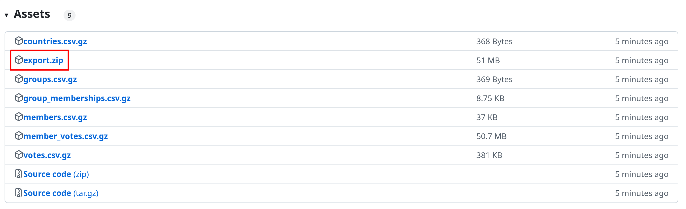

# HowTheyVote.eu Dataset

HowTheyVote.eu collects data about European Parliament roll-call votes and related data such as biographical information about MEPs and political groups. We provide our dataset in CSV format.

**[Read more about HowTheyVote.eu and our data license.](https://howtheyvote.eu/about)**

> [!TIP]
> In case of questions or feedback, please feel free to open a [ticket](https://github.com/HowTheyVote/howtheyvote/issues/new?template=Blank+issue&labels=data)!
> You can also reach out via email: mail at howtheyvote.eu
> In case you encounter an **error in our data**, please use [this form](https://tally.so/r/w2eb1M?type=Incorrect+vote+results&link=https%3A%2F%2Fhowtheyvote.eu) to report it!

## Latest Exports

To download the current dataset click [here](https://github.com/HowTheyVote/data/releases/latest).

There, you will find the documentation for each data export. At the bottom of each export, you can download all files as a single `export.zip` file.



## Stable Links

Besides downloading the whole export as a single `.zip` file, you can also download individual files.

These are provided as `csv.gz` files and are e.g., useful for scripting purposes. For example, the URL `https://github.com/HowTheyVote/data/releases/latest/download/votes.csv.gz` will always link to the latest available `Votes` CSV.

### How to: Load the export files into `pandas`

As an illustration, using these stable links, the following snippet shows how you can load the `Votes` table from our export into a `pandas` dataframe. Executing this code will always load the latest available version of this file.

```python
import pandas as pd
votes_df = pd.read_csv('https://github.com/HowTheyVote/data/releases/latest/download/votes.csv.gz', compression='gzip')
votes_df.head()
```

We also provide a file called `last_updated.txt`, in which the creation time of the export is stored as a timestamp.